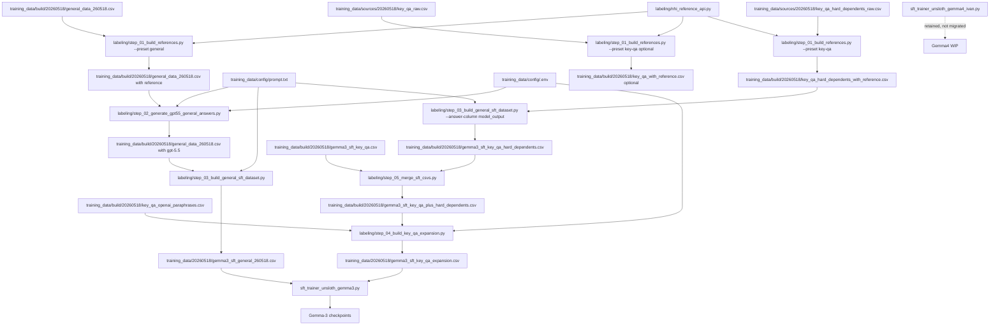

# Data And Training Flow

`training_data/20260518/` is the final training snapshot. It intentionally contains only
files read directly by `sft_trainer_unsloth_gemma3.py`.

Source data, rebuild inputs, and retained diagnostics live outside the final
snapshot:

| Path | Purpose |
| --- | --- |
| `training_data/20260518/` | Final SFT CSVs used directly by Gemma-3 training. |
| `training_data/sources/20260518/` | Traceable source CSVs for this data version. |
| `training_data/build/20260518/` | Rebuild inputs and caches for generated final CSVs. |
| `training_data/config/` | Shared prompt and local API environment file. |
| `training_data/archive/20260518/` | Retained backups and diagnostics, including `duplicate.csv`. |
| `labeling/` | Data-building utilities and shared helpers. |

## Final Training Inputs

```text
training_data/20260518/gemma3_sft_general_260518.csv
training_data/20260518/gemma3_sft_key_qa_expansion.csv
```

## Flowchart



## Commands

```bash
python labeling/step_01_build_references.py --preset general
python labeling/step_02_generate_gpt55_general_answers.py --mode generate
python labeling/step_03_build_general_sft_dataset.py
python labeling/step_04_build_key_qa_expansion.py
python sft_trainer_unsloth_gemma3.py
```

Key QA expansion is reproducible from:

```bash
python labeling/step_04_build_key_qa_expansion.py \
  --input training_data/build/20260518/gemma3_sft_key_qa.csv \
  --cache training_data/build/20260518/key_qa_openai_paraphrases.csv
```

Optional key QA reference retrieval uses the same reference builder:

```bash
python labeling/step_01_build_references.py --preset key-qa
```

## Key QA Hard Negative Rebuild

The 2026-06-03 hard-dependent seed file adds contrastive cases for dependent
enrollment rules, especially sibling negative cases and direct-line relatives
with eligibility conditions:

```text
training_data/sources/20260603/key_qa_hard_dependents_raw.csv
```

Fetch current chatbot references for those questions:

```bash
python labeling/step_01_build_references.py \
  --preset key-qa \
  --input training_data/sources/20260603/key_qa_hard_dependents_raw.csv \
  --output training_data/build/20260603/key_qa_hard_dependents_with_reference.csv \
  --user-column user_input \
  --answer-column model_output \
  --workers 1 \
  --checkpoint-every 1
```

For an internal API host, set one of these in `training_data/config/.env` before
running the reference step:

```bash
NHI_SMARTCHAT_BASE_URL=https://nhismartchat.nhi.gov.tw
# or override each endpoint explicitly:
# NHI_SMARTCHAT_CONVERSATION_URL=https://host/api/-/conversations
# NHI_SMARTCHAT_STREAM_URL_TEMPLATE=https://host/api/chatbot/conversations/{conversation_id}/stream
# NHI_SMARTCHAT_CONTEXTS_URL_TEMPLATE=https://host/api/chatbot/conversations/{conversation_id}/chats/{chat_id}/rephrased-contexts
```

Build hard-negative SFT rows:

```bash
python labeling/step_03_build_general_sft_dataset.py \
  --input training_data/build/20260603/key_qa_hard_dependents_supported_reference.csv \
  --output training_data/build/20260603/gemma3_sft_key_qa_hard_dependents.csv \
  --user-column user_input \
  --reference-column reference \
  --answer-column model_output \
  --id-prefix key-qa-hard-dependent
```

Merge existing key QA SFT with hard-negative SFT:

```bash
python labeling/step_05_merge_sft_csvs.py \
  --input training_data/build/20260603/gemma3_sft_key_qa.csv \
  --input training_data/build/20260603/gemma3_sft_key_qa_hard_dependents.csv \
  --output training_data/build/20260603/gemma3_sft_key_qa_plus_hard_dependents.csv
```

If OpenAI paraphrase generation is available, rebuild paraphrase expansion from
the merged base. Use a separate cache so the existing paraphrase cache remains
untouched:

```bash
python labeling/step_04_build_key_qa_expansion.py \
  --input training_data/build/20260603/gemma3_sft_key_qa_plus_hard_dependents.csv \
  --cache training_data/build/20260603/key_qa_plus_hard_dependents_openai_paraphrases.csv \
  --output training_data/20260603/gemma3_sft_key_qa_expansion.csv
```

For the current 2026-06-03 snapshot, the final expansion reuses the existing
2026-05-18 expanded key QA rows and appends the supported hard-dependent SFT rows
directly, repeated 10 times:

```text
training_data/20260518/gemma3_sft_key_qa_expansion.csv
  + training_data/build/20260603/gemma3_sft_key_qa_hard_dependents.csv x 10
  -> training_data/20260603/gemma3_sft_key_qa_expansion.csv
```

This yields 2,700 key QA rows: 2,500 original expanded rows and 200
hard-dependent rows.
